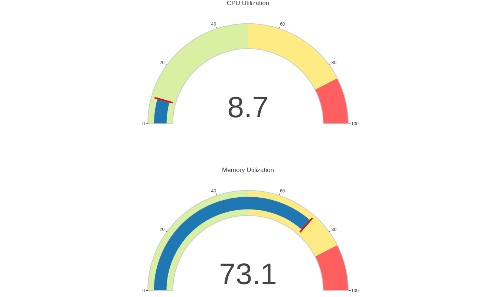

# cpu-memory-utilization
DevOps project - Python, Docker, Kubernetes up localy!


## A small python project that shows real CPU and memory usage with a refresh every 10 seconds It is implemented with Kubernetes

## Must have installed localy Docker and Kubernetes

## Setup
```
git clone https://github.com/voiz80/cpu-memory-utilization.git
cd cpu-memory-utilization
```
## Usage
```
docker build -t my-flask-app .
minicube start
```
## Transfer of the image created on the local system to the registry within Minikube.
```
minikube image load my-flask-app1
minikube image ls
## or create directly with minicube
minikube image build -t my-flask-app .
```
## Apply with kubectl
```
kubectl apply -f kubernetes.yaml
```
## Access project
```
minikube service example-app-src
```
## If you want Clear all
```
kubectl delete -n default deployment example-app-dep
kubectl delete -n default service example-app-src
minikube image rm my-flask-app1
```
